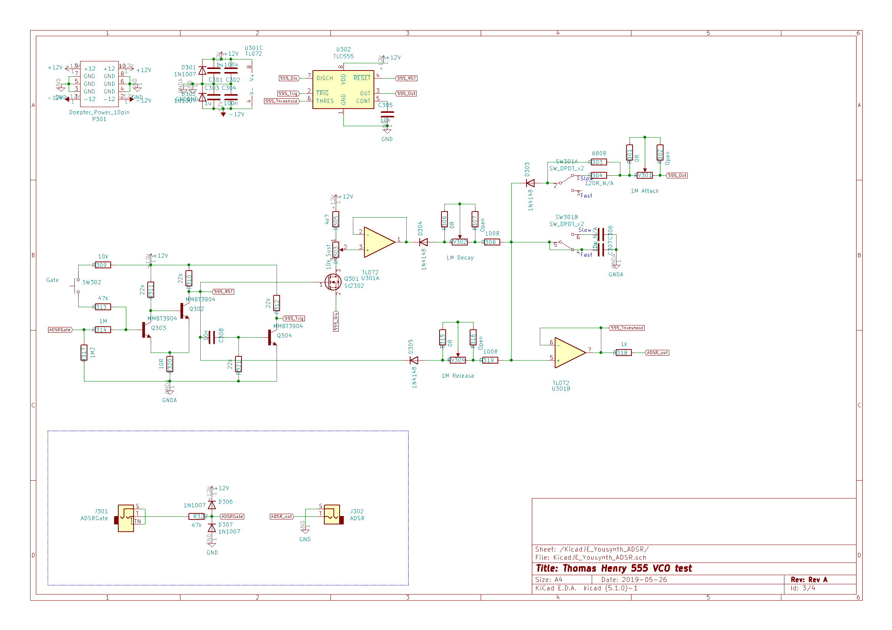
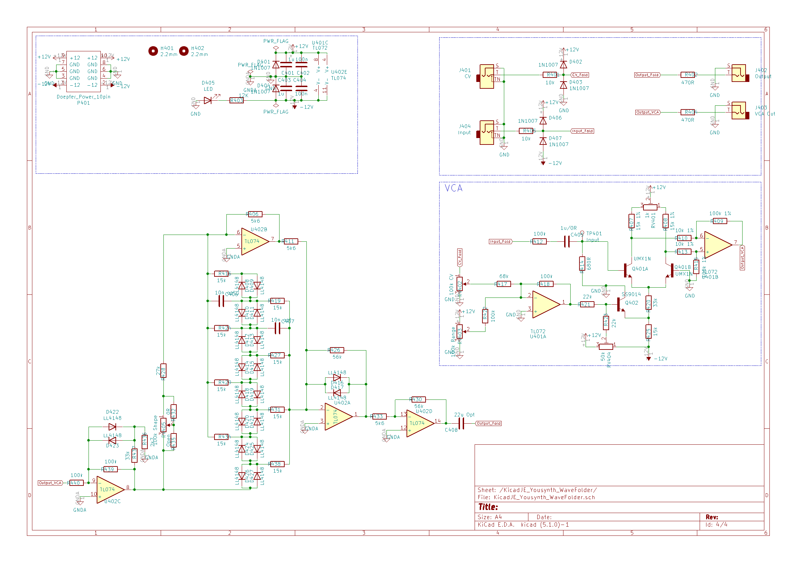

# KicadJE_MoogVCF
Based on https://www.yusynth.net/Modular/Commun/MOOGVCF/Moogfilter-sch.jpg

Based on https://www.yusynth.net/Modular/Commun/WAVEFOLDER/new/JHWavefolder-sch.gif

Based on https://www.yusynth.net/Modular/Commun/ADSR/ADSR555-FINAL.gif

# Status - PCB  in the mail
## Initial 
| Stage  | Detail | Status |
| ------------- | ------------- | ------------- |
| create material  | sch/pcb | OK  |
| | gerber | OK |
| production  |   | Ok |
|  | produced | OK |
|  | delivered | Ok |
## Preliminary validation
| Test  | Detail | Status |
| ------------- | ------------- | ------------- |
| Initial Inspection | | OK - silk messed a bit |
| Initial Technical Test |  | OK |
| Initial Product Test | VCF | Not working due to missing Caps - working ok after botch'ed caps added |
| Initial Product Test | ADSR | OK - Sustain seems strange |
| Initial Product Test |  |  |

## Secondary validation
| Test  | Detail | Status |
| ------------- | ------------- |------------- |
| Product Test |  | |
| Product Test | ADSR | Works fine after added 100k resistors instead of 0R across 100KB pots |
| Product Test |  | |
| Quality | | |
| Quality | ADSR | ADSR interacts when turned all the way down|
| Quality | | |
| Long Term Product Test |  |  |
| Power Draw |  | 

## Errata
### Errata - 

## Issues and Notes
### VCF
* C214 should be 1206 (its a bit difficult to find 22u 0805 in 16v)
* C211 and C212 should be 1206 or bigger (10u 16v potentially sounds better than 0805)

# Pictures

# Inspiration

# Schematic
## Ladder Filter

## Simple 555 ADSR

## WaveFolder

# Inspiration
 http://jhaible.com/legacy/jh_shaper_B.pdf
 
 https://www.yusynth.net/Modular/Commun/WAVEFOLDER/new/JHWavefolder-sch.gif

 https://www.yusynth.net/Modular/Commun/MOOGVCF/Moogfilter-sch.jpg 
